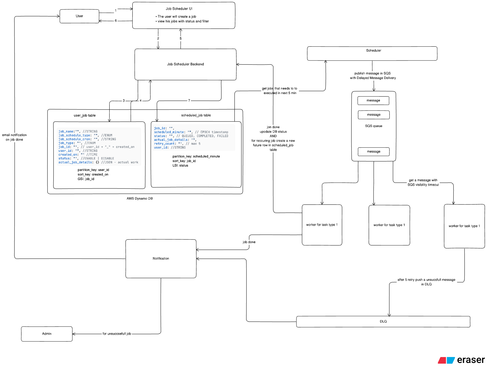

# Job Scheduler

Time taken: 90 Minutes



## Functional requirements

1. User can
    1. Create a new job
    2. See all the jobs he created with filter
    3. Edit job
    4. Delete job
2. Job can be one-time or recurring
3. The user can opt for a notification
4. User can run an existing future job - JUST NOW
5. 10k jobs can be executed each day
6. READ vs WRITE ratio may be almost the same

## Non-Functional Requirements

1. The system should be reliable - the scheduled job should be executed at the exact time
2. CAP - High availability is needed

## APIs

---

**Create a new job**

Request: POST /job/create

Body:

```json
{
  job_name: STRING,
  job_schedule_type: ENUM (ONCE | RECCURING),
  job_schedule: {
    year:"",
    month:"",
    date:"",
    hour:"",
    minute:"",
    days_of_week:""
  },
  job_type: ENUM
}
```

job_schedule will be converted to a cron expression by the backend

job_type will be predefined static jobs that can be scheduled

Response: success message with job_id

---

**Get all jobs with filters**

Request: GET /job?status=?job_type=?

Response: JSON response

---

**Edit a job**

Request: PUT /job/update

```json
{
  job_name: STRING,
  job_schedule_type: ENUM (ONCE | RECCURING),
  job_schedule: {
    year:"",
    month:"",
    date:"",
    hour:"",
    minute:"",
    days_of_week:""
  },
  job_type: ENUM,
  job_id: ""
}
```

---

**Delete a job**

Request: DELETE /job/{job-id}

---

## ChatGPT HLD Review

Nice diagram — good starting point. I reviewed your HLD and the uploaded requirements/design.

Below I give: 1) quick high-level feedback (what's strong / what to improve), 2) concrete suggestions & small fixes you can apply to the design, and 3) a long list of deep-dive questions an interviewer is very likely to ask (grouped by topic) so you can prepare answers.

---

### 1) High-level positives (what you did well)

* Clear component separation: UI → Backend → Scheduler → SQS → Workers → DLQ → Notification. That makes responsibilities easy to reason about.

* Use of SQS (visibility timeout + DLQ) is sensible for at-least-once delivery and retrying failed work.

* You captured both one-time and recurring jobs and the idea of creating a new future row for recurring jobs.

* DynamoDB tables split into a user_job table (for UI queries) and scheduled_job table (for scheduling) — good separation of access patterns.

* You included notification and admin DLQ flows — shows you thought about failures and observability.

---

### 2) Issues / risks / improvements (concrete)

These are things you should be ready to explain or change:

**A. Scheduling scan & partition hot-spot risk**

* Current idea: scheduler "get jobs that need to be executed in next 5 min" from `scheduled_job` table. If your partition key is `scheduled_minute` (exact minute timestamp), careful: many jobs for the same minute = hot partition.

* Fixes:

  * Use time-bucket + hashing (e.g., `bucket = hash(minute) % N`) as partition key, with `scheduled_minute` as sort key. Or

  * Use a dedicated scheduler index in Redis (sorted set by timestamp) for near-term scheduling and DynamoDB for metadata. Or

  * Use distributed cron (e.g., Amazon EventBridge Scheduler / Step Functions / Quartz cluster) for high scale.

**B. Recurring job handling and atomicity**

* You said: job done → update DB status and for recurring jobs create new future row. This must be transactional to avoid double-scheduling or lost future runs.

* Fix: use DynamoDB `TransactWriteItems` (update existing run status + insert next-run row) or perform compare-and-set (conditional write) so only one scheduler/worker performs the transition.

**C. Exactly-once vs at-least-once semantics**

* SQS + workers will be at-least-once. Worker must be idempotent. Design idempotency:

  * Add `job_execution_id` (unique) in message and persist executed IDs (or use DynamoDB conditional writes keyed by `job_execution_id`) so replays are ignored.

  * Make job handlers idempotent (stateless or reversible).

**D. Visibility timeout / long-running jobs**

* Visibility timeout must be > typical job runtime; if job may run long or can be retried, use heartbeating (extend visibility) or use a different mechanism for very long jobs (e.g., step functions).

**E. Timezone / clock & scheduling precision**

* Clarify timezone handling (store cron in UTC, UI converts).

* Handling clock skew: run scheduler leader election (if multiple scheduler instances) and ensure NTP sync.

**F. DynamoDB schema notes**

* `user_job` partition key: `user_id` — good for UI queries. Add GSI on `created_on` if you need global sort/filter across users.

* `scheduled_job` key choices: partition_key = time-bucket (not raw minute), sort_key = job_id. Consider GSIs for queries by status or job_type.

* Use TTL for one-time completed jobs (if you want to auto-expire).

**G. Scalability & throughput**

* You stated 10k jobs/day — small scale, but architect for spikes or higher volume. Plan capacity mode (on-demand vs provisioned) for DynamoDB and autoscaling for workers.

* For higher throughput, consider sharding scheduler work across time-buckets.

**H. Observability & operational controls**

* Add metrics & traces: jobs scheduled, jobs started, jobs succeeded/failed, retry count, DLQ count, processing latency, scheduler lag.

* Add dashboards & alerts: DLQ non-zero, scheduler lag > threshold, error rate spike.

**I. Security**

* AuthN/AuthZ for APIs (who can create jobs), IAM permissions for SQS/DynamoDB, encrypt data at rest, avoid secrets in job payloads.

**J. Cost & optimization**

* SQS costs and DynamoDB read/write costs are relevant. If jobs are many but metadata small, DynamoDB on-demand might be cheapest initially.

---

### 3) Suggested small design changes / clarifications you should call out in interview

* Use `scheduled_time_bucket` = `floor(ts / bucket_size)` (e.g., 1 minute or 5 minute bucket) + `shard_id` hashed to avoid hot partitions.

* Store job metadata separately from job-run records. Table `scheduled_job` holds definition + next_run timestamp; `job_execution` table holds each run attempt with `execution_id`, status, start_time, end_time — this simplifies retries & history.

* For recurring jobs: keep a `cron_expr` + next_run timestamp. After run, compute next_run and update `next_run` in the same transaction as record of execution.

* When producing SQS messages, include: `{ job_id, execution_id, scheduled_at, user_id, idempotency_key }`

* Use DynamoDB transactions to move `status` from `QUEUED` → `IN_PROGRESS` atomically when worker starts (or use conditional update with expected `status=QUEUED`).

---

### 4) Operational runbook / failure handling to mention

* If scheduler fails: other scheduler instance should detect missing heartbeat and assume leadership (use DynamoDB conditional lock or etcd/consul/Zookeeper).

* If worker crashes mid-job: message becomes visible after visibility timeout; retry will occur — ensure idempotency.

* If DLQ grows: alert admin, provide UI to inspect and requeue or fix manually.

* If large backlog: auto-scale workers based on SQS backlog metric.

---

### 5) Deep-dive interviewer questions (grouped) — prepare succinct answers & diagrams/code where helpful

#### Data model / queries

1. Why two tables? Why `user_job` vs `scheduled_job`?

2. What are the partition & sort keys for each table? Why did you choose them? What are the access patterns?

3. How will you query "jobs scheduled between T1 and T2"? Which index supports that?

4. How do you avoid hot partitions when many jobs are scheduled for the same minute?

5. How do you model recurring jobs and job history — same table or separate?

#### Scheduler & leader election

6. How does the scheduler find the jobs to schedule (query pattern)? Do you poll or use push-based?

7. If you run multiple scheduler instances, how do you ensure only one publishes a message per scheduled job (avoid duplicates)?

8. How do you handle clock skew between scheduler and workers?

9. How often do you run the scheduler? What granularity (minute/second) and why?

#### Consistency / atomicity

10. When a worker finishes a job, you create the next occurrence for recurring jobs and update status. How do you ensure this is atomic?

11. How do you handle partial failures (message published but DB update failed, or vice versa)?

12. How do you ensure idempotency for retry attempts?

#### Messaging (SQS)

13. Why SQS? Why not Kafka / Kinesis? What trade-offs?

14. What SQS settings do you pick: visibility timeout, delay seconds, redrive policy, message retention?

15. How many retries before DLQ? How do you decide?

16. How do you reprocess messages from the DLQ safely?

#### Workers & execution semantics

17. Are workers stateless? How do you scale them?

18. How do you ensure job handlers are idempotent? Provide an example design.

19. How do you support long-running jobs (e.g., > 15 minutes)?

20. What if a job invokes external services that are down — backoff strategy? Circuit breaker?

#### Performance & scaling

21. You've targeted 10k jobs/day — how will the system behave at 10x or 100x?

22. How to scale scheduler and workers? How to partition workload?

23. What are the read/write RCU/WCU needs for DynamoDB? Which capacity mode?

#### Observability / SLOs / SLA

24. What SLOs (scheduling latency / success rate) do you guarantee?

25. What metrics & alerts will you add?

26. What runbooks exist for a stuck scheduler or runaway worker?

#### Security / multi-tenant concerns

27. How do you ensure a user can only see/modify their jobs?

28. How to protect sensitive data inside job payloads?

29. How do you prevent privilege escalation via jobs (e.g., jobs that run other code)?

#### Edge cases / correctness

30. What happens if two scheduler instances both claim "leader"? Race conditions?

31. How to handle daylight saving/timezones?

32. How do you handle missed schedules (system down at scheduled time)? Do you run missed jobs on recovery?

33. How do you detect and prevent duplicate execution if a worker doesn't complete and the message becomes visible?

#### Cost / trade-offs / alternatives

34. Why DynamoDB vs RDBMS vs Redis? Pros/cons for scheduling metadata.

35. Why SQS vs EventBridge Scheduler vs Cron? When would you pick managed scheduler?

36. What are cost trade-offs for keeping full history vs only last N runs?

#### Implementation details

37. Show pseudo-code for scheduler loop (locking + query + publish + transaction).

38. Show pseudo-code for worker start: conditional update to mark IN_PROGRESS and record execution_id.

39. How will you test the system (unit tests, integration tests, load tests)? What test cases?

---

### 6) Example answers / snippets you should memorize

* **Leader election approach (short)**: Use a DynamoDB row as a lease record with `lease_owner`, `lease_expires_at`. Scheduler instance attempts conditional write to claim lease. If it holds the lease, it schedules; other instances back off.

* **Atomic schedule-to-message workflow**:

  1. Scheduler queries the `scheduled_job` for due items.

  2. For each job: `TransactWriteItems` with:

     * Put SQS-message-metadata row in `job_execution` (status=PENDING, execution_id),

     * Update `scheduled_job` status to `QUEUED`/advance `next_run` if recurring (or mark COMPLETE for one-time).

       If transaction succeeds, publisher sends message to SQS (note: publishing to SQS is not in DynamoDB transaction; handle failure by marking `job_execution` as FAILED after a timeout or compensating step).

* **Idempotency pattern**: maintain `job_execution` table keyed by `execution_id`. Worker, at start, uses conditional put to create a `job_execution` row with status=IN_PROGRESS only if not present. If present and state=COMPLETED, worker exits.

---

### 7) Example metrics & alerts to present in interview

* Metrics: scheduler lag (scheduled_time → published_time), queue depth (SQS visible messages), worker success rate, retries per job, DLQ size, avg job runtime.

* Alerts:

  * DLQ size > 0 or rising.

  * Scheduler lag > threshold (e.g., 30s).

  * Error rate > X% in workers.

---

### 8) Quick checklist / TODO list to improve your diagram & HLD doc

* Explicitly show `job_execution` table in diagram (separates run history from job definitions).

* Add `lease` mechanism for scheduler leader election in the diagram.

* Annotate SQS configuration: visibility timeout, redrive policy, delay settings.

* Add flow for "run now" (user triggers immediate execution) showing how that bypasses scheduler (backend should enqueue the job immediately).

* Note idempotency keys & conditional writes in diagram notes.

* Add monitoring box (CloudWatch/Prometheus + alerting) in diagram.

---

### 9) Final short summary you can say in the interview

* "This design uses DynamoDB to store job definitions and metadata, a scheduler process which scans near-term buckets and enqueues messages to SQS, workers that process messages and persist execution history, and a DLQ/notification system for failed runs. Key challenges are atomic transitions for recurring jobs, idempotency for at-least-once semantics, partition hot-spotting for time-based keys, and leader election for a scheduler. We mitigate those by time-bucketing + sharding, using DynamoDB transactions, an execution table for idempotency, and a lease-based leader election."

