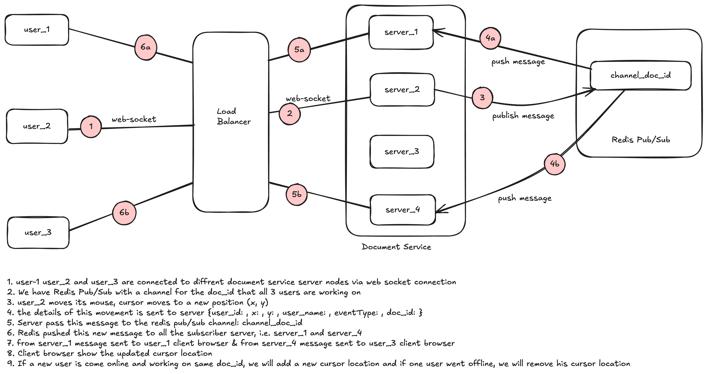
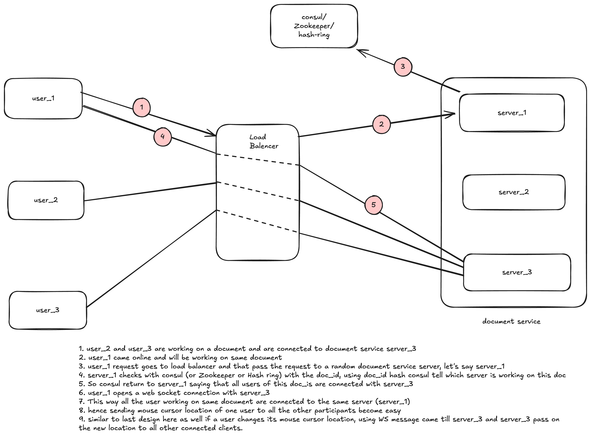

# Mouse Pointer Tracking

## **APPROACH 1 — Redis Pub/Sub Based (Distributed Servers, No Fixed Owner)**

**(Each user may connect to ANY document server, and servers coordinate via Redis Pub/Sub + a shared cursor state)**




### **1. Client connects**

1. User opens the document.
2. Client initiates WebSocket to Load Balancer.
3. LB routes to any available `server_X` (round-robin / random / least connections).
4. Server authenticates → authorizes user for `doc_id`.

### **2. Server joins the document channel**

1. Server subscribes to Redis Pub/Sub channel:

    ```
    channel = doc:{doc_id}
    ```

2. Server fetches the current cursor snapshot from Redis Hash:

    ```
    HGETALL doc:{doc_id}:cursors
    ```

3. Server sends this snapshot to the newly connected client.

### **3. Client sends mouse movement**

1. Client throttles cursor events (e.g., 30 Hz).
2. Client sends:

    ```
    { type: "cursor_move", doc_id, user_id, x, y, ts, seq }
    ```

   to **its server_X** via WebSocket.


### **4. Server receives, updates state, and publishes**

1. `server_X` updates Redis Hash:

    ```
    HSET doc:{doc_id}:cursors {user_id: {x, y, color, name, ts}}
    EXPIRE doc:{doc_id}:presence:{user_id}  (heartbeat TTL)
    ```

2. `server_X` publishes the event to Pub/Sub channel:

    ```
    PUBLISH doc:{doc_id} <cursor_event>
    ```


### **5. Fan-out to all servers**

1. All servers that have users connected for this `doc_id` receive the pub/sub event.
2. Each server sends it via WebSocket to its **local connected users** only.

### **6. Client updates UI**

1. Browser receives cursor update → animates cursor on screen.

### **7. Presence management**

1. Client sends heartbeat every N seconds.
2. Server renews TTL in Redis.
3. If TTL expires → server publishes:

    ```
    { type: "user_left", user_id }
    ```


### **8. Reconnect scenario**

1. User reconnects → LB may send to any server.
2. Server fetches snapshot from Redis Hash.
3. Server subscribes to pub/sub channel.
4. Sends snapshot to client → client begins receiving delta updates.

### **Failure handling**

- If a server crashes → others continue receiving pub/sub events (no single-point).
- Lost events are acceptable because cursor updates are ephemeral (next update overwrites last).

This approach is **simple, robust, scalable**, great for real-time UI with many small sessions.

## **APPROACH 2 — Single Authoritative Server per Document (Consistent Hash / Consul / Zookeeper / Hash Ring)**

**(All users working on the same document are routed to the SAME server_3)**




### **1. Document ownership resolution**

1. User opens document → client contacts LB.
2. LB sends WebSocket handshake to a random server (e.g., server_1).
3. `server_1` asks coordination store (Consul/ZK/hash-ring):

    ```
    owner = lookup(doc_id)
    ```

   or

    ```
    owner = hash(doc_id) % N_servers
    ```


### **2. Two options for connection routing**

**A) Redirect model (simplest)**

1. If owner is NOT server_1 → server_1 responds with redirect:

    ```
    { redirect_to: server_3 }
    
    ```

2. Client establishes WebSocket directly to **server_3**.

**B) Proxy model**

1. server_1 proxies the WS connection to server_3 (client never sees redirect).

**Redirect is simpler; proxy costs more CPU for server_1.**

### **3. Owners maintain real-time state**

1. server_3 keeps in-memory state:

    ```
    doc_state.cursors = { user_id → {x,y,ts,color,name} }
    ```

2. server_3 also persists to Redis Hash (for recovery only):

    ```
    HSET doc:{id}:cursors {...}
    ```


### **4. New client joins**

1. server_3 sends full cursor snapshot to client.
2. server_3 announces user join to other clients:

    ```
    broadcast { type: "user_joined", user_id }
    ```


### **5. Client sends mouse movement**

1. Client throttles cursor update messages (30 Hz).
2. Sends WS event to **server_3**:

    ```
    { cursor_move, user_id, x, y, seq, ts }
    ```


### **6. Authoritative server broadcasts**

1. server_3 updates in-memory state.
2. server_3 sends the cursor event to all connected clients of the same doc.
3. Optionally persists (cheap):

    ```
    HSET doc:{id}:cursors {...}
    ```


### **7. Presence & TTL**

1. Client heartbeats → server_3 refreshes TTL in Redis.
2. If TTL expires → server_3 broadcasts `user_left`.

### **8. Failover**

1. server_3 crashes → its ephemeral lease in Consul/ZK expires.
2. Another server is elected owner (server_1).
3. New owner does:

    ```
    state = HGETALL doc:{id}:cursors
    ```

4. New owner becomes authoritative.
5. Clients reconnect → step 3 happens again → they get routed to new owner.

This approach gives you:

- Perfect ordering
- Extremely low latency
- No cross-server fan-out
- But needs coordination + failover logic

## WHICH APPROACH TO USE?

### Use **Approach 1 (Redis Pub/Sub)** when:

- many documents
- each doc has 2–5 active users
- simple scaling
- ephemeral cursor updates (loss is ok)

### Use **Approach 2 (Single Owner)** when:

- each document may have **large active groups** (20–100+)
- strict ordering matters
- you want ultra-low latency
- you can deal with owner-failover logic