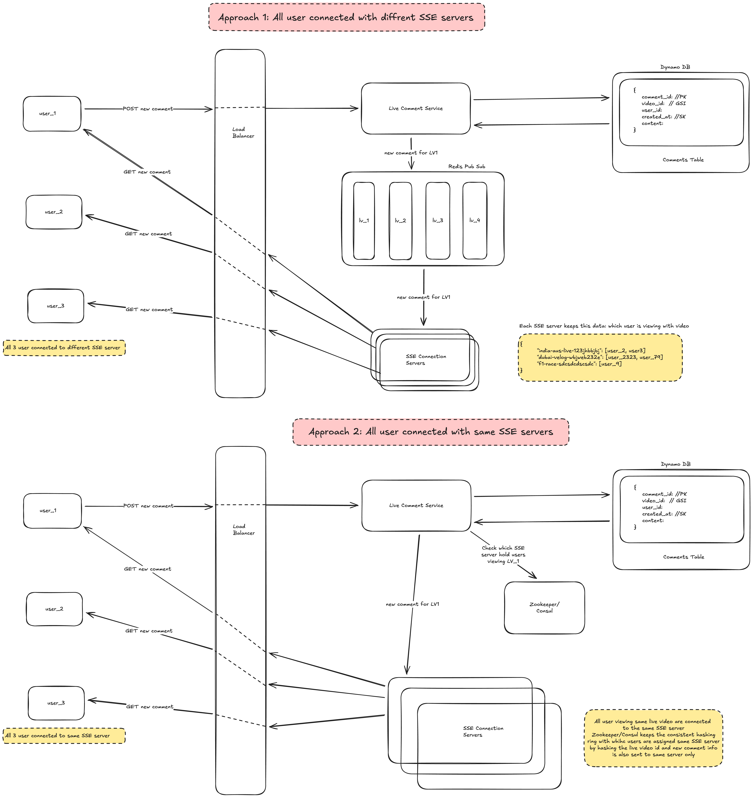

# Live Video Comments (FB/ YouTube/ Instagram/ Twitter)



## Approach 1: All user connected with different SSE servers

1. In this approach all the users that are watching the live video are connected with a SSE connection(to get lice comments). All users are connected to diffrent SSE Connection Servers, that means there is no patterns and maybe via Round Robbin users are assigned the SSE Connection Servers that has the lease load.
    1. So user_1 is connected to sse_server_1 & user_2, user_3 are connected to sse_server_2
2. Now lets say user_1 comment a new comment.
3. This comment will be a POST call.

    ```json
    POST /ytlive/{video-id}/comment
    body {
    	content: "Love from Jaipur!"
    }
    ```

4. The POST request hit the load balancer and then [Live Comment Service] server
5. This new comment will now save in the DB, there we are using Dynamo DB for fast writes

    ```json
    {
        comment_id: "saas-adad-122-xq-q", //PK
        video_id: "india-aus-live-123jhbbjbj",  // GSI
        user_id: "user-asda23e",
        created_at: "21313131231231", //SK
        content: "Love from Jaipur!"
    }
    ```

6. For each live video we have a topic/channel in our redis pub sub
7. When a user is connected to a SSE server, the server know which live video user is viewing and that SSE server subscribe to the respective topic/channel in our redis pub sub for that live video
    1. sse_server_1 subscribed to the topic/channel named “india-aus-live-123jhbbjbj” as user_1 is connected to this server
    2. sse_server_1 subscribed to the topic/channel named “india-aus-live-123jhbbjbj” as user_2 and user_3 is connected to this server
8. [Live Comment Service] server save the new comment in the DB and then post a new message for the new comment in the Redis topic/channel “india-aus-live-123jhbbjbj”
9. Redis pushed this new message to all the SSE servers that have subscribed to it, i.e. sse_server_1 and sse_server_2
10. sse_server_1 and sse_server_2 gets the new message and then send the message to all the connected users. As each server would have connected to many users viewing many live video, the sse server will keep a mapping to see which users is viewing which live video like this:

    ```json
    {
    	"india-aus-live-123jhbbjbj": [user_2, user3]
    	"dubai-velog-wbjweb232e": [user_2323, user_79]
    	"f1-race-sdcsdcdscsdc": [user_9]
    }
    ```

11. By looking into mapping of which user is viewing which video, server_1 and server_2 send new comment into to user_1, user_2 and user_3 via SSE connection.

## Approach 1: All user connected with same SSE servers

1. In this approach, when a users a clicking a viewing a live video, according to the live video id we try to keep all the user connected to same server that are viewing the same video, we do that using zookeeper/Consul that implement consistent hashing on the live video id
2. As now all user are connected to same server we can sent the new comment info to the exact same SSE server and that SSE server can propagate the new comment to all the connected users.

# ChatGPT HLD Review

Nice diagrams — you’ve captured the two obvious, practical alternatives and the important pieces (LB → LiveComment service → DB → pub/sub → SSE cluster). Below is focused, interview-style feedback: what’s good, what’s missing, practical trade-offs for each approach, and a recommended hybrid/production-ready design with concrete improvements you can call out in an HLD discussion.

---

# What’s good (things you already did well)

* Clear end-to-end flow: write path → DB → pub/sub → SSE servers → clients. That’s exactly the right fan-out model.
* You separated concerns: LiveComment service (ingest + persist) from SSE connection servers (fan-out).
* You thought about per-video topics/channels — that’s the standard way to partition events.
* You considered using consistent hashing / service registry for co-location of viewers — shows you’re thinking about affinity and minimizing cross-server fan-out.
* You considered DynamoDB for fast writes and Redis pub/sub for low-latency delivery — reasonable low-latency primitives.

---

# High-level tradeoffs (the interviewer will expect you to discuss these)

* **Fan-out vs. affinity:** Approach 1 favors simple horizontal scaling but increases cross-server fan-out traffic. Approach 2 minimizes fan-out but requires sticky assignment + coordination (and rebalancing).
* **Broker durability & ordering:** Redis pub/sub is low-latency but ephemeral (no persistence, no consumer offsets). For high traffic and guarantees consider durable streaming (Kafka / Redis Streams).
* **Connection model:** SSE is simple and one-way (server→client). WebSockets give bidirectional control (e.g., per-connection acks, presence, typing indicators). Pick based on feature needs.
* **Rebalance cost:** Assigning viewers by video to servers reduces inter-server messaging but reassignments (server failure or auto-scale) cause lots of connection moves and state rehydration.
* **Backpressure & overload:** Fan-out spikes (popular stream) can overwhelm SSE servers or broker — need rate limiting, batching, and queueing.

---

# Per-approach pros & cons

### Approach 1 — random assignment (many SSE servers subscribe to many video topics)

**Pros**

* Simple LB & autoscaling (stateless SSE servers except for in-memory mapping).
* Failures are isolated: losing one SSE server only affects its connected viewers.
* No complex consistent hashing / registry logic required.

**Cons / risks**

* **High cross-server fan-out:** Every comment published to the Redis topic will be delivered to *every* SSE server subscribed. If many servers are subscribed to many videos, this multiplies traffic.
* **Redis pub/sub scale limits:** Redis pub/sub can become bottleneck with many channels and many subscribers. Also no persistence or consumer offset.
* **Memory footprint:** Each SSE server keeps mappings for many videos → can be large.
* **Delivery guarantees & ordering:** Redis pub/sub gives best-effort; messages lost on broker failover.

**When this works**

* Small/medium scale, small number of concurrent videos, or when per-video audience is widely distributed and broker load is low.

---

### Approach 2 — affinity by video (all viewers of a video go to same SSE server)

**Pros**

* **Minimal fan-out:** LiveComment service can directly route event to the single SSE server for that video. Very efficient for hot videos.
* Easier to maintain **ordered delivery** (one server responsible).
* Lower inter-server network cost.

**Cons / risks**

* **Single server hot-spot:** A very popular video could overload its SSE server. Need replication / sharding within that video.
* **Coordination complexity:** You need a reliable mapping service (Consul / ZooKeeper / central metadata) and handle rebalancing when servers scale or fail.
* **Reconnections:** If the responsible server fails, many clients must reconnect to the new server — client churn + potential missed events.
* **Operational complexity:** Handling migrations of large client sets from one server to another is tricky.

**When this works**

* When you can shard popular videos across a pool (e.g., pick N SSE servers per video) or when most videos have modest viewers and only a few get extremely hot.

---

# Concrete improvements / production recommendations (what to say in interview)

1. **Hybrid: Partition by video → use broker partitions (not one topic per video).**

    * Don’t create a Redis pub/sub channel per video if you have millions of videos. Use a partitioning scheme:

        * Use Kafka / Pulsar or Redis Streams: create a smaller set of partitions and route video IDs to partitions (hash(video_id) → partition). Consumers (SSE servers) subscribe to partitions and use consumer groups.
        * For really hot videos, allow multiple consumers to share the partition (and coordinate per-video delivery at consumer level).
    * This gives durability, consumer offsets, replay, and better scaling than pure Redis pub/sub.

2. **Keep a light cache of recent comments per video**

    * Store N most recent comments in Redis list per video for fast reads / initial page load and when clients reconnect (replay last N events). Persist canonical data in DB (DynamoDB) for long-term storage.

3. **Sequence numbers & idempotency**

    * Assign a monotonic sequence number per video (can be produced by LiveComment service or derived from ordered stream). Clients use sequence numbers to detect missing messages or duplicates on reconnect.
    * This helps maintain consistent ordering across reconnects and multi-server fan-out.

4. **Backpressure, batching & rate limiting**

    * Buffer and batch small comments into single SSE events when appropriate.
    * Per-user rate limits to prevent spam / abuse; burst protection for extremely active chats.
    * Use per-connection out-queues and drop oldest/lowest-priority messages when client can't catch up.

5. **Avoid Redis pub/sub for critical durability**

    * Redis pub/sub is low-latency but ephemeral. For reliability use Kafka/Redis Streams and a fan-out service:

        * LiveComment writes to DB + produces event to stream.
        * Fan-out consumers (SSE fleet) read from stream and push to clients.
        * Stream gives persistence and replay on reconnect or server restart.

6. **SSE vs WebSocket**

    * Use **WebSockets** for two-way needs (typing, moderator controls, pings, ACKs). If you only push new comments and want simple reconnection semantics, SSE is fine. Be ready to justify choice.

7. **Sticky routing vs service registry**

    * Prefer **LB route-by-key** (consistent hashing at the proxy/LB) or use a lightweight registry that maps video→SSE server(s). Rendezvous hashing is simpler and minimizes remaps compared to naive consistent hashing.
    * For cloud: use ALB/NGINX with route-by header (video-id hash) or an intelligent proxy that sets a backend based on hashed video id.

8. **Handling hot videos**

    * For very popular streams:

        * **Replicate** connections across multiple SSE servers and use a coordinator to ensure each client gets a subset of message stream with full coverage (or use multicast in logical layer).
        * Or split by audience shard (e.g., round-robin assignment but only among servers dedicated to that video) and produce one fan-out stream that multiple identical consumers read (consumer group reads same partition but you need broadcasting semantics — a different approach: produce 1 event per consumer group member).

9. **Operational concerns**

    * Monitor: connection count per server, publish latency, consumer lag, message rates, error rates.
    * Graceful drain: when scaling down, transfer client connections or use connection handover + rejoin process to avoid mass reconnect storms.
    * Metrics and alerting: SSE queue size, avg event latency, DB write latency.

10. **Security & moderation**

    * Authenticate SSE/WebSocket connections (JWT).
    * Moderation pipeline: real-time filter/flag before broadcasting (or broadcast + moderate with deletion events).
    * Abuse detection & throttling.

---

# Short recommended architecture you can sketch in interview

* **Ingest path:** LB → LiveComment service (auth, persist to DynamoDB, write event to Kafka/RedisStream).
* **Streaming layer:** Kafka/RedisStream topics partitioned by hash(video_id). Stream provides durability + ordering per partition.
* **Fan-out layer:** SSE/WebSocket fleet (consumer group) reads partitions and maintains mapping video_id → local connected clients; stream offsets tracked for crash recovery. For hot videos use multiple consumers with sub-sharding.
* **Cache:** Redis lists for last N comments per video for quick initial loads & replays.
* **Routing:** LB uses header-based hashing or service registry (Rendezvous hashing) to reduce connection churn, but not strictly required—consumer reads stream anyway.
* **Client reconnect:** client sends last-seen-sequence-id to fetch missed events from cache/stream replay.

---

# Example things to mention in interview to show depth

* Why Redis pub/sub alone is risky (no persistence, hard to scale to millions of channels).
* Why Kafka/Redis Streams gives replay & consumer offsets.
* Use of sequence numbers for consistent ordering & client reconnection behavior.
* Handling backpressure and hot shards (rate limit, batching, replicate, shard).
* Choice of SSE vs WebSocket and tradeoffs (TLS, proxies, browser support).
* How you’d autoscale SSE servers and drain connections gracefully.

---

# Quick checklist you can memorize & state

* Durable stream (Kafka / Redis Streams) for fan-out ✔
* Cache last N comments in Redis for reconnects / initial load ✔
* Sequence numbers per video for ordering ✔
* Rate limiting & moderation pipeline ✔
* Strategy for hot videos (replication/sharding) ✔
* Monitoring + graceful drain ✔

---
