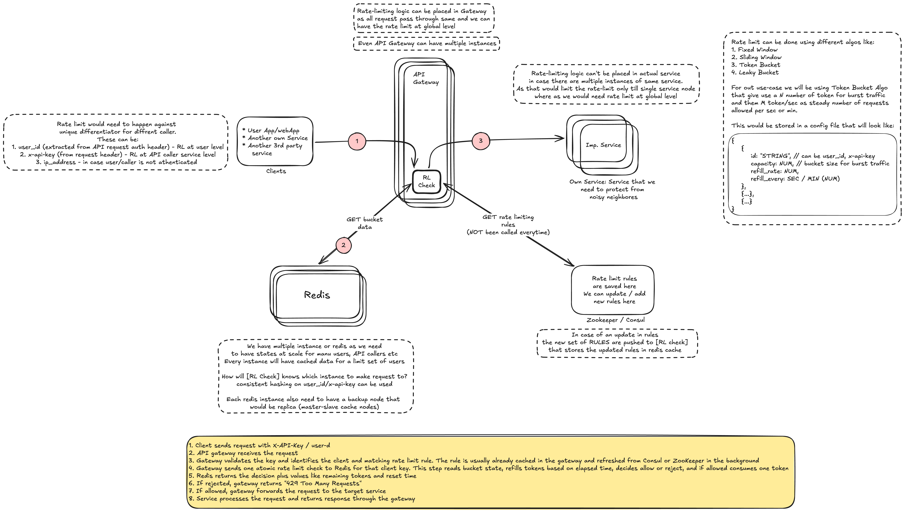

# Rate Limiter

# My Approach


1. Client sends request with X-API-Key / user-d
2. API gateway receives the request
3. Gateway validates the key and identifies the client and matching rate limit rule. The rule is usually already cached in the gateway and refreshed from Consul or ZooKeeper in the background
4. Gateway sends one atomic rate limit check to Redis for that client key. This step reads bucket state, refills tokens based on elapsed time, decides allow or reject, and if allowed consumes one token
5. Redis returns the decision plus values like remaining tokens and reset time
6. If rejected, gateway returns "429 Too Many Requests"
7. If allowed, gateway forwards the request to the target service
8. Service processes the request and returns response through the gateway

<details>
  <summary>ChatCPT Design Review</summary>

# ✅ What you did really well

### 1. **Correct placement of rate limiting (Gateway)**

* Putting **rate limiting at API Gateway** is 👍
* Your reasoning is correct:

    * All requests pass through it → global enforcement possible
    * Avoids duplication in services

💡 Bonus: You also mentioned service-level RL → shows depth.

---

### 2. **Good choice of Redis**

* Redis is the **industry-standard choice**
* You correctly handled:

    * Fast reads/writes
    * Stateful counters
    * Horizontal scaling

✔ Also good:

* Mention of **consistent hashing**
* Mention of **replication (master-slave)**

---

### 3. **Token Bucket choice**

* You explicitly chose **Token Bucket**, and:

    * Explained burst handling
    * Config-driven rules

This is exactly what interviewers want (not just listing algorithms).

---

### 4. **Clear request flow**

Your numbered flow is clean and realistic:

* Extract identity (API key / user_id)
* Fetch rule
* Check Redis
* Allow/reject
* Forward request

👉 This shows **end-to-end thinking**, not just components.

---

### 5. **Multi-tenant thinking**

You handled:

* user_id
* api_key
* ip_address fallback

That’s a **big plus** (real-world systems need this).

---

### 6. **Dynamic config via Zookeeper / Consul**

* Excellent addition
* Shows awareness of:

    * Runtime updates
    * Config distribution

---

# ⚠️ Areas of Improvement (Important)

## 1. ❗ Atomicity in Redis (VERY important gap)

You wrote:

> "Gateway sends atomic rate limit check to Redis"

But **how?**

👉 This is a key interview expectation.

### Problem:

If you do:

```
GET tokens
UPDATE tokens
```

→ Race condition

### Fix:

Use:

* **Lua script in Redis** (BEST answer)
* or `INCR + EXPIRE` (for simpler models)

💡 Add this explicitly:

> "Use Redis Lua script to ensure atomic read-modify-write of token bucket"

---

## 2. ❗ Missing TTL / memory cleanup

Currently:

* Keys will grow infinitely

### Fix:

Mention:

* Use **TTL on keys**
* Expire inactive users

Example:

```
user:123 → expires after 1 hour of inactivity
```

---

## 3. ❗ No discussion of failure scenarios

This is where senior candidates stand out.

### What if Redis is down?

Options:

* Fail open (allow traffic) ✅ safer UX
* Fail closed (block traffic) ❌ risky
* Fallback:

    * Local in-memory rate limiting (best effort)

👉 Add:

> "Gateway can maintain a local fallback cache for short-term RL if Redis fails"

---

## 4. ❗ No multi-region / distributed challenge

Right now:

* Your design is **single-region biased**

### Problem:

* Multiple gateways across regions → inconsistent limits

### Fix:

Mention:

* Region-level RL vs global RL
* Tradeoff:

    * Strong consistency (slow)
    * Eventual consistency (practical)

💡 Senior-level line:

> "We can shard users to regions or use region-local limits with soft global enforcement"

---

## 5. ❗ Rule caching not deeply explained

You said:

> rules cached in gateway

Good—but missing:

### Questions:

* Cache invalidation?
* TTL?
* Push vs pull?

### Improve:

* Use:

    * **Push-based updates (via Consul watch)**
    * OR TTL-based refresh

---

## 6. ❗ No mention of sliding window accuracy vs approximation

Token bucket is good, but:

👉 Add comparison:

* Token bucket → burst friendly
* Sliding window → more accurate
* Fixed window → simplest but flawed

This shows deeper understanding.

---

## 7. ❗ No mention of per-endpoint / per-method limits

Right now:

* Only user/api_key level

### Improve:

Add:

* Per API:

  ```
  /login → stricter
  /search → relaxed
  ```

---

## 8. ❗ Missing observability

Very important in real systems.

Add:

* Metrics:

    * allowed requests
    * rejected requests
    * latency
* Alerts:

    * sudden spike in rejections

---

## 9. ❗ No mention of warmup / cold start issue

New users:

* bucket full → burst spike

Optional improvement:

* gradual warmup
* or smaller initial capacity

---

# 🚀 How to make this “Senior-Level Excellent”

If you add these 5 lines in interview, you’ll stand out:

### 🔥 1. Atomicity

> “I’ll use Redis Lua scripts to ensure atomic token updates.”

### 🔥 2. Failure handling

> “If Redis fails, gateway falls back to local rate limiting (fail-open strategy).”

### 🔥 3. Multi-region

> “We can use region-local rate limiting with eventual consistency for global users.”

### 🔥 4. Observability

> “We’ll track RL metrics and expose dashboards for throttling patterns.”

### 🔥 5. Extensibility

> “We can support per-user, per-API, and per-IP layered rate limits.”

---

# 🧠 Final Verdict

### Overall rating (for interview):

* **Mid-level engineer:** ⭐⭐⭐⭐⭐ (Excellent)
* **Senior engineer:** ⭐⭐⭐⭐☆ (Very good, needs depth in edge cases)

---

# 👍 Summary

### Strong points:

* Correct architecture (Gateway + Redis)
* Good algorithm choice (Token Bucket)
* Clean flow
* Config-driven design

### Needs improvement:

* Atomicity (Redis Lua)
* Failure handling
* Multi-region thinking
* Observability
* Deeper tradeoffs

</details>
