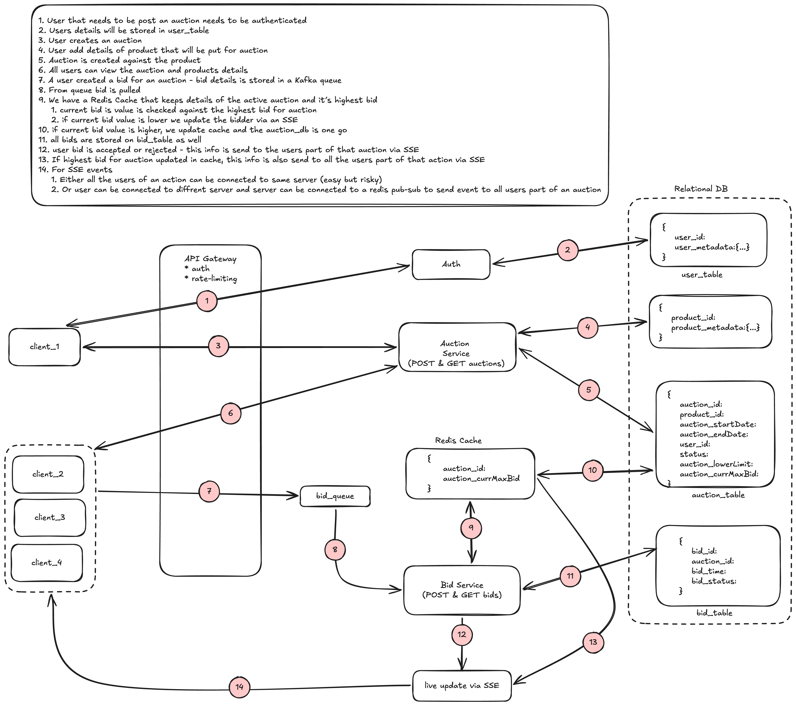

# Auction Service

# My Approach


1. User that needs to be post an auction needs to be authenticated
2. Users details will be stored in user_table
3. User creates an auction
4. User add details of product that will be put for auction
5. Auction is created against the product
6. All users can view the auction and products details
7. A user created a bid for an auction - bid details is stored in a Kafka queue
8. From queue bid is pulled
9. We have a Redis Cache that keeps details of the active auction and it’s highest bid
    1. current bid is value is checked against the highest bid for auction
    2. if current bid value is lower we update the bidder via an SSE
10. if current bid value is higher, we update cache and the auction_db is one go
11. all bids are stored on bid_table as well
12. user bid is accepted or rejected - this info is send to the users part of that auction via SSE
13. If highest bid for auction updated in cache, this info is also send to all the users part of that action via SSE
14. For SSE events
    1. Either all the users of an action can be connected to same server (easy but risky)
    2. Or user can be connected to different server and server can be connected to a redis pub-sub to send event to all users part of an auction

<details>
  <summary>ChatCPT Design Review</summary>

# 👍 What’s Done Well

### 1. Clear end-to-end flow

You’ve captured the full lifecycle:

* Auth → Auction creation → Bidding → Validation → Notification
  This is **very important in interviews**, and you did it cleanly.

---

### 2. Good use of async processing (Kafka)

* Putting bids into a queue is **excellent**
* Helps with:

    * Burst traffic (auction spikes)
    * Backpressure handling
    * Decoupling ingestion from processing

👉 This is a **strong design signal**

---

### 3. Redis for hot data (active auctions)

* Storing:

    * `auction_id`
    * `currentMaxBid`

Perfect choice because:

* Auctions are **read-heavy + write-heavy + low latency**
* Redis gives **O(1) access**

---

### 4. SSE for real-time updates

* Good choice for:

    * Simpler than WebSockets
    * Works well for **server → client push**

Also good that you thought about:

* Single server vs distributed servers + pub/sub

---

### 5. Separation of services

* Auth Service
* Auction Service
* Bid Service

👍 Clean separation of responsibilities

---

### 6. DB schema thinking

You identified:

* `user_table`
* `product_table`
* `auction_table`
* `bid_table`

That’s exactly what interviewers expect.

---

# ⚠️ Gaps / Risks in Current Design

These are the areas where an interviewer will start probing.

---

## 1. ❗ Race Conditions in Bidding

### Problem:

Two bids arrive at the same time:

* Both read same highest bid from Redis
* Both think they are valid
* Both update → incorrect winner

👉 Your current flow:

```
Read from Redis → compare → update Redis + DB
```

This is **NOT atomic**

---

## 2. ❗ Redis + DB consistency issue

You said:

> update cache and DB in one go

But:

* Redis and DB are separate systems
* No distributed transaction

👉 Possible issue:

* Redis updated but DB failed (or vice versa)

---

## 3. ❗ No partitioning / scaling strategy

* What happens when:

    * 1M concurrent auctions?
    * Hot auctions (IPL tickets type)?

👉 Currently:

* No mention of:

    * sharding
    * partitioning
    * load distribution

---

## 4. ❗ Kafka usage is incomplete

You used Kafka for:

* Bid ingestion

But:

* No mention of:

    * partition key
    * ordering guarantee

👉 Critical question:

> How do you ensure bids for same auction are processed in order?

---

## 5. ❗ No failure handling

Missing:

* What if Bid Service crashes?
* What if Kafka consumer lags?
* What if Redis goes down?

---

## 6. ❗ SSE scalability concern

You correctly pointed out:

> all users on same server is risky

But missing:

* Connection limits per server
* Fanout strategy at scale

---

## 7. ❗ Auction closing logic missing

* Who decides winner?
* What happens at auction end time?

👉 Very important in auction systems

---

## 8. ❗ No idempotency

If Kafka retries:

* Same bid may be processed twice

---

# 🚀 Improvements (Make This Interview-Ready)

---

## ✅ 1. Fix Race Condition (Most Important)

Use **atomic operation in Redis**

Options:

* Redis Lua script (best)
* Redis sorted set (ZSET)

Example approach:

```
ZADD auction:{id} score=bid_amount user_id
ZREVRANGE → highest bid
```

Or:

```
WATCH auction_key
GET current_max
if new_bid > current:
  MULTI
  SET new_max
  EXEC
```

👉 Mention: *“I’ll use Redis atomic ops to ensure consistency”*

---

## ✅ 2. Kafka Partitioning Strategy

Partition by:

```
auction_id
```

👉 Benefit:

* All bids of same auction go to same partition
* Maintains order
* Avoids race condition at consumer level

---

## ✅ 3. Stronger Data Flow

Better approach:

```
Client → Kafka → Bid Consumer
            ↓
        Redis (atomic check)
            ↓
        DB write (async)
            ↓
        Event → SSE/WebSocket
```

👉 Redis becomes **source of truth for active auctions**

---

## ✅ 4. Introduce Read/Write Separation

* Writes → Bid Service
* Reads → Auction Service + Redis

👉 Improves scalability

---

## ✅ 5. Auction State Machine

Add states:

* CREATED
* ACTIVE
* ENDED
* CANCELLED

👉 Prevents invalid bids after auction ends

---

## ✅ 6. Auction Closing Mechanism

Two approaches:

* **Scheduler (cron / worker)** checks expired auctions
* Or **delayed queue (Kafka delay / Redis TTL)**

At end:

* Finalize winner
* Persist result
* Notify users

---

## ✅ 7. SSE Scaling Improvement

Better architecture:

* API servers stateless
* Use:

    * Redis Pub/Sub OR Kafka
* Each server subscribes to auction events

👉 You already hinted this — good!

---

## ✅ 8. Add Idempotency

* Each bid should have:

    * `bid_id` (UUID)
* Store processed IDs or use DB constraint

---

## ✅ 9. Caching Strategy Improvement

Not just:

* currentMaxBid

Also cache:

* auction metadata
* top N bids

---

## ✅ 10. Rate Limiting & Fraud Protection

Missing but important:

* Prevent bid spamming
* Prevent bots

---

# 💡 Advanced Points (Interview Gold)

If you mention these → **you’ll stand out**

---

### 🔥 1. Hot Auction Problem

* Some auctions get huge traffic

Solution:

* Partition by auction
* Dedicated resources for hot auctions

---

### 🔥 2. Event Sourcing (Advanced)

Instead of updating state:

* Store all bids as events
* Reconstruct state

---

### 🔥 3. WebSockets vs SSE

You can say:

* SSE is fine for MVP
* WebSockets better for:

    * bid acknowledgements
    * bi-directional communication

---

### 🔥 4. Consistency Model

* Eventual consistency between Redis & DB is acceptable
* Redis = real-time truth
* DB = durable storage

---

# 🧠 Final Verdict

### Strong points:

* Good system decomposition
* Correct use of Redis + Kafka
* Real-time updates handled
* Clean flow

### Needs improvement:

* Concurrency handling (critical)
* Scaling strategy
* Failure handling
* Auction lifecycle

---

# 🎯 If interviewer asks: “Rate your design?”

You can say:

> “This design handles core functionality well using async processing and caching, but I would improve it by adding atomic bid handling, partitioning by auction_id, and a stronger consistency model between Redis and DB to handle concurrency and scale.”

</details>